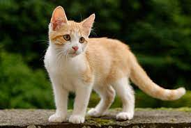
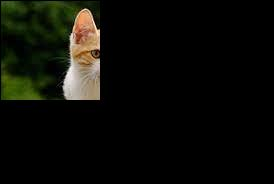

## Add image
* Replace dir include your image with  
const QString path = "/home/huongnv/QT_ws/cutImage/image/";
* Replace "input.jpeg" whith name of your image    
auto ret = myImage.load(path + "input.jpeg");

# Demo 

